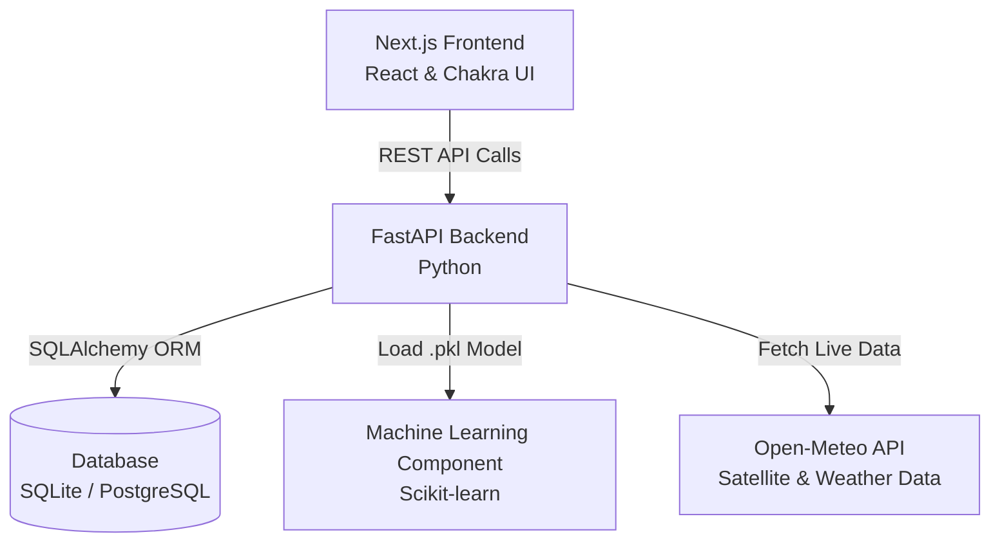

# Smart City Data Platform

## 📖 Overview
The **Smart City Data Platform** is an interactive, real-time web application designed to monitor, analyze, and predict urban environmental factors. It integrates a sleek, modern **Next.js frontend** dashboard with a high-performance **FastAPI backend**, providing live telemetry on Air Quality Index (AQI), Water Quality Index (WQI), and key geospatial analytics.

## ✨ Features
- **Real-Time Dashboards:** Dynamic visualization of urban metrics.
- **Geospatial Analytics:** Map-level insights utilizing Open-Meteo satellite metadata.
- **Predictive Modeling:** Integrates Machine Learning to forecast climate and AQI risk categories using live telemetry.
- **Secure Access:** Role-based authentication (Admin / User scopes).

---

## 🏗️ Architecture Stack

The project leverages a strictly decoupled architecture combining the speed of modern JavaScript frameworks with Python's data-science supremacy.



**Core Technical Components:**
1. **Frontend:** Built via Next.js and React using Chakra UI for responsive, component-driven design.
2. **Backend:** Python FastAPI server handling authentication, geographic data routing, and analytics.
3. **Database Layer:** SQLite (for local development) scaled to PostgreSQL, interfaced by SQLAlchemy in Python and Prisma in the frontend schema.

---

## 📊 Database Tables (Schema)

The module reliably persists geographical and user metadata utilizing these four core tables:

### 1. `users`
Manages system authentication and access logs.
| Column | Type | Description |
|--------|------|-------------|
| `id` | Integer | Primary key |
| `full_name` | String | User's full display name |
| `email` | String | Unique email address (Indexed) |
| `hashed_password` | String | Encrypted password |
| `role` | String | Defines system privileges (`admin` or `user`) |

### 2. `places`
Stores critical geographical landmarks, emergency services, and city infrastructure.
| Column | Type | Description |
|--------|------|-------------|
| `id` | Integer | Primary key |
| `name` | String | Name of the institution/place |
| `type` | String | Classification (e.g., hospital, police station) |
| `latitude` | Float | Geographical coordinate (Lat) |
| `longitude` | Float | Geographical coordinate (Lng) |
| `details` | String | JSON-formatted metadata |

### 3. `air_quality`
Time-series telemetry for urban air pollution.
| Column | Type | Description |
|--------|------|-------------|
| `id` | Integer | Primary key |
| `area_name` | String | Monitored zone name |
| `aqi` | Integer | Computed Air Quality Index |
| `pm25` | Float | Particulate matter < 2.5 µm |
| `pm10` | Float | Particulate matter < 10 µm |
| `latitude` | Float | Sensor/Area Latitude |
| `longitude` | Float | Sensor/Area Longitude |
| `timestamp` | DateTime | Recording time |

### 4. `water_quality`
Time-series telemetry for tracking urban water sources.
| Column | Type | Description |
|--------|------|-------------|
| `id` | Integer | Primary key |
| `location_name` | String | Monitored reservoir/source name |
| `wqi` | Float | Water Quality Index (WQI) |
| `ph` | Float | Acidic/alkaline metric |
| `latitude` | Float | Geographical coordinate (Lat) |
| `longitude` | Float | Geographical coordinate (Lng) |
| `timestamp` | DateTime | Recording time |

---

## 🧠 Algorithms & Machine Learning Logic

The intelligence module depends on robust data processing algorithms to generate actionable conclusions:

### 1. Random Forest Classifier (Ensemble ML Model)
- **Role:** Deployed for predicting and classifying the environmental and Climate Risk Categories in real-time.
- **Why Random Forest:** It is highly resistant to overfitting on non-linear weather data and expertly handling high variance within temperature/humidity gradients.
- **Input Features (`X`):** 
  - Temperature metrics (Max, Min, Avg)
  - Relative Humidity (%)
  - Rainfall (mm)
  - Wind Speed (km/h)
  - Surface Pressure (hPa)
  - Cloud Cover (%)
- **Output (`y`):** ML-encoded categorical predictions mapping precisely to the predicted climate or AQI severity.

### 2. Live Satellite Telemetry Aggregation Algorithm
- **Role:** Rather than operating only on historical training datasets, the algorithm dynamically injects live API feed data from Open-Meteo's weather forecasting and air quality engines via GPS telemetry tracking (`min_lat`, `max_lat`).
- **Process:** It retrieves temperature, pressure, precipitation, and cloud cover inputs and mathematically structures them to mirror the input matrix defined inside the `.pkl` schema requirements, feeding live GPS stats to generate real-time confidence scores (%).

### 3. Threshold Optimization & Geospatial Averaging
- **Role:** Analyzes localized hazard risks dynamically via bounding boxes (`latitude / longitude` constraints).
- **Process:** The system filters heavy `.csv` datasets locally, iterating only through map-viable bounds. It calculates the moving average (`mean()`) of AQI and WQI levels to calculate instantaneous area pollution factors. The algorithm parses these numeric constraints and uses hard-threshold logic models (e.g., `If Avg_AQI > 200 => "High Air Pollution Detected"`) to formulate string-based, frontend-readable insights.

---

## 🚀 Setup & Execution

### 1. Start the Backend API (FastAPI)
```powershell
cd backend
python -m venv .venv
.\.venv\Scripts\Activate
pip install -r requirements.txt
uvicorn app.main:app --reload --host 0.0.0.0 --port 8001
```

### 2. Start the Frontend (Next.js)
```powershell
# Open a new terminal session
cd frontend
npm install
npm run dev
```

*Navigate to `http://localhost:3000` to interact with the Smart City application.*

---

## 🌐 Deployment (GitHub Pages)

The frontend of this project is configured for deployment via **GitHub Pages**.

**Live Link:** [https://hithesh916.github.io/smart-city-geospatial-platform/](https://hithesh916.github.io/smart-city-geospatial-platform/)

### How to Deploy Changes:
1.  **Commit and Push:** Ensure all changes are committed and pushed to the `master` branch.
2.  **GitHub Actions:** A GitHub Action (`.github/workflows/nextjs.yml`) will automatically trigger, build the frontend, and deploy it.
3.  **Pages Settings:** In your GitHub repository settings, go to **Pages** and ensure the **Source** is set to **GitHub Actions**.

### ⚠️ Backend Hosting Note:
GitHub Pages only hosts static frontend files. To make the interactive features (Search, ML Predictions, Map Data) work in the live link:
1.  Host the Python backend on a service like [Render](https://render.com/), [Railway](https://railway.app/), or [Heroku](https://www.heroku.com/).
2.  Update the `NEXT_PUBLIC_API_URL` environment variable in your GitHub repository secrets (or update the code) to point to your hosted backend URL.
